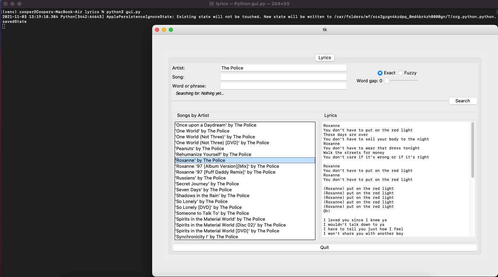

# Description
A CLI tool for setting up the Lyrics database.


### TODO
1. write tests
# 2. Add notebook tabs
# 3. Add Youtube video lookup functionality.
4. As the fuzzy search for words and phrases is working, load the results into the list box as they come in

### Purpose(s)
To setup a database for a future lyrics search program.  
Store artists and song names in SQL database.  
To search through the data collection concurrently.  
To find YouTube videos that match the lyrics.  

### Important Points
The final program will contain 5 major stages/areas:  
    * Gather    - collect/scrape the data from the internet and save in an easy to use/store format  
        * CLI tool: `scraper.py`  
    * Clean     - normalize/rename/preprocess in preparation for easy use in later stages/areas  
        * CLI tool: `preprocess.py`  
    * Search    - search for grammar patterns/"vocabulary lists"/etc   
    * Metrics   - calculate metrics that require iterating through the entire data set  
    * Recommend - using user profiles and data about the lyrics, recommend other forms of media related to the user's search  

### Setup
1. Make sure `Databases/lyrics.csv` exists.
2. Run `init_database.py` once.
3. Inspect the contents of the DB with "DB Browser for SQLite" application or shell.

### Operation
Run `guy.py`  

Possible Search Patterns:  

|Search Input|||||||||  
|---|---|---|---|---|---|---|---|---|---|  
|Artist  |X   |X   |X   |O   |X   |O   |O   |O
|Song    |X   |X   |O   |X   |O   |X   |O   |O
|Word    |X   |O   |X   |X   |O   |O   |X   |O


### Testing
Run `python3 -m pytest [filename]`  


#TODO, update the stuff below
### Notes on Database Operations
* Adding fields to DB
    * manually from DB's shell: `ALTER TABLE songs ADD COLUMN englishScore text;`
    * using this CLI tool: `python3 main.py --dbfield englishScore text`
* Delete fields;
    * have to copy data to new table to delete a field...
* Update a single column single record value;
    * manually from DB's shell: `UPDATE songs SET englishScore=99 WHERE artist="Rihanna";`
* Combine tarballs (uncompressed)
    * manually, go to "Lyrics/" and run:
        ```python
        import tarfile
        from pathlib import Path

        with tarfile.open(name="combined.tar", mode="a") as combined:
            for file_ in Path(".").glob("*.txt"):
                combined.add(file_)
        ```
    * then, move "combined.tar" to the project's root dir.


## Profiling
Using `cProfile`;  
    1. run `python3 setup.py build_ext --inplace`  
    2. `cProfile.run("lyric_search(songs, members)", filename=f"profile_results/lyric_search_{datetime.utcnow()}.stats")`  
    3. results are saved in `profile_results/lyric_search_<timestamp>.stats`  

Using `SnakeViz`;  
    1. use the profile created with cProfile  
    2. run `snakeviz profile_results/<name of profile>`  

Using `line_profiler`;  
    1. mark the function you want to profile with a decorator: `@profile`  
    2. run `kernprof -l -v your_module.py`  
    3. view the results with: `python -m line_profiler your_profile.py.lprof`  
    
Using `pstats`;  
    1. open a python3 shell  
    2. run this;  
        ```python  
            import pstats  
            p = pstats.Stats("<name of profile>")  
            p.print_stats()  
        ```  

Using `memory_profiler`;  
    source; https://pypi.org/project/memory-profiler/  
    1. mark the function you want to profile with a decorator: `@profile`  
    2. run `python3 -m memory_profiler your_module.py`  

General Process;  
    1. Start with cProfile and use the high level view to guide which functions to profile with `line_profiler` or other profilers  
        * run `python3 setup.py build_ext --inplace` to compile  
    2. run this within your code to profile a specific function;  
        * Example, to profile the `lyric_search` function and save in `filename`  

